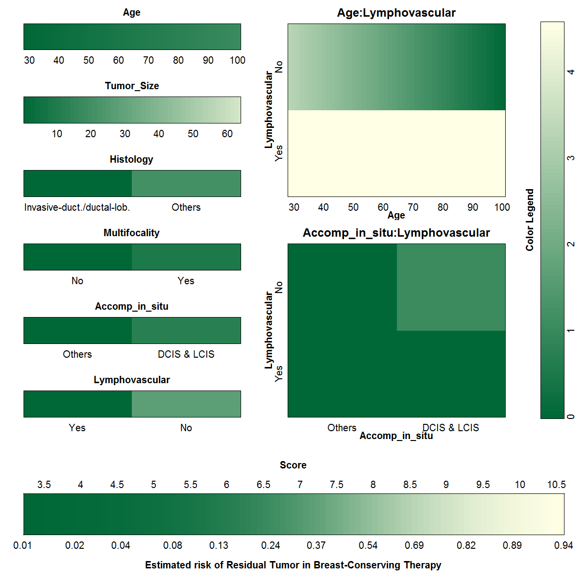

<style>
blockquote{
    padding: 10px 20px;
    margin: 0 0 20px;
    font-size: 16px;
    border-left: 5px solid #eee;
}
</style>

```{r include = FALSE} 
knitr::opts_chunk$set(warning = FALSE, message = FALSE, comment = NA, echo = FALSE)
knitr::opts_chunk$set(cache = FALSE)
options(width=170)
```

```{r include = FALSE, eval = FALSE}
# url <- "https://cran.r-project.org/src/contrib/Archive/VRPM/VRPM_1.2.tar.gz"
# pkgFile <- "VRPM_1.2.tar.gz"
# download.file(url = url, destfile = pkgFile)
# 
# install.packages(c('Hmisc', 'survival', 'fields', 'R2HTML', 'viridis', 'kernlab', 'ROCR','ggplot2', 'shiny'))
# install.packages(pkgs=pkgFile, type="source", repos=NULL)
```

```{r}
pacman::p_load(tidyverse)

d1 <- read.csv("https://raw.githubusercontent.com/VIS-SIG/Wonderful-Wednesdays/master/data/2020/2020-12-09/Reexcision.csv") %>% 
   mutate( hist         = factor(hist, labels = c("Others", "Invasive-duct./ductal-lob.")) %>% 
                            fct_rev(),
           mult.foc     = factor(mult.foc, labels = c("No","Yes")),
           acc.in.situ  = factor(acc.in.situ, labels = c("Others","DCIS & LCIS")),
           lymph.inv    = factor(lymph.inv, labels = c("No","Yes")) %>% 
                           fct_rev(),
           estr.rec     = factor(estr.rec, labels = c("No","Yes")),
           prog.rec     = factor(prog.rec, labels = c("No","Yes")) ) %>% 
   rename(`Residual_Tumor` = RE, 
          `Age` = age,
          `Tumor_Size` = tumor.size,
          `Histology` = hist,
          `Multifocality` = mult.foc,
          `Accomp_in_situ` = acc.in.situ,
          `Lymphovascular` = lymph.inv,
          `Estrogen_receptor` = estr.rec,
          `Progesterone_receptor` = prog.rec) 
```

```{r}
rio::export(d1, "viz_pred.rds")
```

```{r}
# glm(Residual_Tumor ~ . , data = d1, family = "binomial") %>% 
#   MASS::stepAIC(f1,  trace = FALSE)
# 
# glm(Residual_Tumor ~ (.)^2 , data = d1, family = "binomial") %>% 
#   MASS::stepAIC(f1,  trace = FALSE)

# f2 <- glm(Residual_Tumor ~ Age + Tumor_Size + Histology + 
#                           Multifocality + Accomp_in_situ + Lymphovascular, 
#           data = d1, family = "binomial")

f2 <- glm(Residual_Tumor ~ Age + Tumor_Size + Histology + 
            Multifocality + Accomp_in_situ + Lymphovascular +              
            Age*Lymphovascular + Accomp_in_situ*Lymphovascular, 
          data = d1, family = "binomial")
```

>Instead of a table-based approach, the color-based method to present the score system of Residual Tumor. 
The color corresponding to each predictor value corresponds to a number of points, 
which is indicated within each colored interval. The patient's score is the 
sum of the points for all predictors. This score is converted into a risk estimate 
by means of the last color bar where a dark green color indicates a low risk and a 
light green to ecru color indicates high risk. This visualization of the model allows 
users to instantly gauge which predictors contribute most to a high risk estimate. <br> **Van Belle, Vanya, and Ben Van Calster** 
["Visualizing risk prediction models."](https://journals.plos.org/plosone/article?id=10.1371/journal.pone.0132614) 
PloS one 10.7 (2015)

## {.tabset}

### **Overall** Visualization
```{r}
pacman::p_load(VRPM)
colplot(f2, 
        filename = 'viz_pred_01',
        coloroptions = 2, 
        zerolevel = 'min',
        risklabel = "Estimated risk of Residual Tumor in Breast-Conserving Therapy")
```
{width=85% height=85%}


### **Individual** Visualization (ID=140)
```{r}
p1 <- d1[140,]

colplot(f2, 
        filename = 'viz_pred_02',
        coloroptions = 2, 
        zerolevel = 'min',
        risklabel = "Estimated risk of Residual Tumor in Breast-Conserving Therapy",
        obs = p1)
```
{width=85% height=85%}

### **Prediction Model** <small> Logistic Regression w/ Interactions </small>
```{r}
pacman::p_load(gtsummary)
theme_gtsummary_compact()

tbl_regression(f2, 
               exponentiate = TRUE,
               pvalue_fun = ~style_pvalue(.x, digits = 2)) %>% 
  bold_labels()
```
